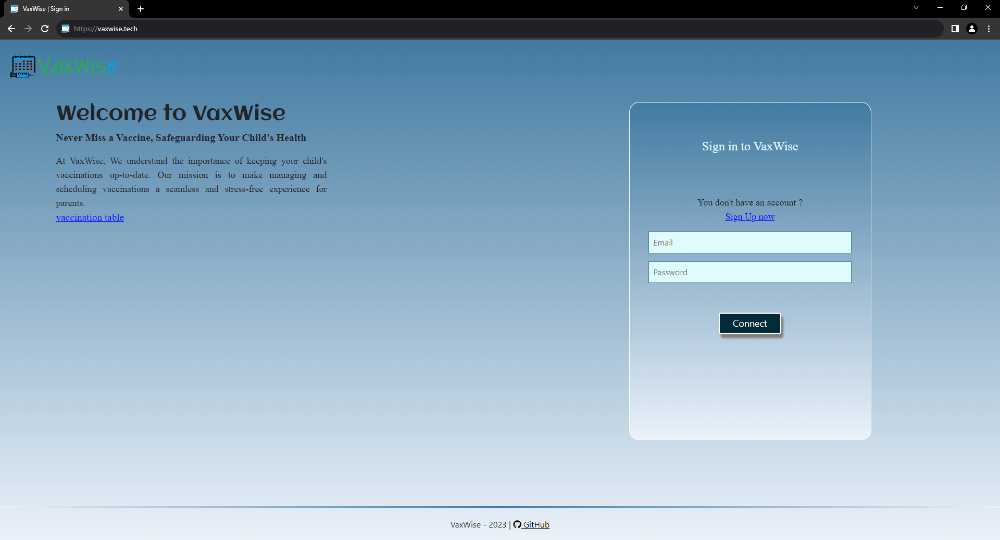

# VaxWise App

## Introduction

VaxWise is a vaccination reminder application designed to streamline the vaccination process for parents and paramedical staff. When it's time for a vaccination, the system automatically sends an email to parents up to two days prior, providing details about the child's information and the scheduled vaccination.
 
- Website: [https://vaxwise.tech](https://vaxwise.tech)
- Blog article: [https://bit.ly/3NpMt3d](https://bit.ly/3NpMt3d)
- LinkedIn: [https://www.linkedin.com/in/ahmed-rifki-ab868926b/](https://www.linkedin.com/in/ahmed-rifki-ab868926b/)

## Installation

To get started with VaxWise, follow these steps:

1. Clone the repository:
    ```bash
    git clone https://github.com/RifkiAhmed/VaxWise.git
    ```

2. Install the required dependencies:
    ```bash
    python3 -m pip install -r requirements.txt
    ```

3. Change to the project directory:
    ```bash
    cd VaxWise
    ```

4. Turn on 2 step verification for your email account, watch this video to learn more about it [video](https://www.youtube.com/watch?v=g_j6ILT-X0k)

5. Set up a database and user:

6. Declare those environment variables with yours data:
    ```bash
    export MYSQL_USER='';        # MySQL username
    export MYSQL_PWD='';         # MySQL password
    export MYSQL_HOST='';        # MySQL host
    export MYSQL_DB='';          # MySQL database name
    export ADMIN_EMAIL='';       # Admin email
    export SECRET_KEY='';        # Secret key for app
    export MAIL_USERNAME='';     # Email username
    export MAIL_PASSWORD='';     # Email password
    export MAIL_SERVER='';       # Email server
    export MAIL_PORT=;           # Email port
    ```

7. Run the application:
    ```bash
    python3 -m vaxwise.app
    ```

## Licensing

MIT License

Copyright (c) 2023 Ahmed RIFKI

Permission is hereby granted, free of charge, to any person obtaining a copy of this software and associated documentation files (the "Software"), to deal in the Software without restriction, including without limitation the rights to use, copy, modify, merge, publish, distribute, sublicense, and/or sell copies of the Software, and to permit persons to whom the Software is furnished to do so, subject to the following conditions:

The above copyright notice and this permission notice shall be included in all copies or substantial portions of the Software.

THE SOFTWARE IS PROVIDED "AS IS", WITHOUT WARRANTY OF ANY KIND, EXPRESS OR IMPLIED, INCLUDING BUT NOT LIMITED TO THE WARRANTIES OF MERCHANTABILITY, FITNESS FOR A PARTICULAR PURPOSE AND NONINFRINGEMENT. IN NO EVENT SHALL THE AUTHORS OR COPYRIGHT HOLDERS BE LIABLE FOR ANY CLAIM, DAMAGES OR OTHER LIABILITY, WHETHER IN AN ACTION OF CONTRACT, TORT OR OTHERWISE, ARISING FROM, OUT OF OR IN CONNECTION WITH THE SOFTWARE OR THE USE OR OTHER DEALINGS IN THE SOFTWARE.
